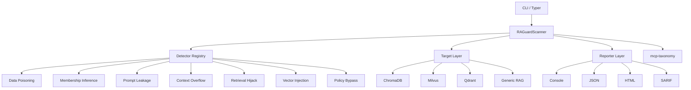

# Architecture

RAGuard follows a modular architecture with four layers:



## Detector System

Detectors are registered via a decorator pattern:

```python
from raguard.detectors import register_detector
from raguard.detectors.base import BaseDetector

@register_detector
class MyDetector(BaseDetector):
    name = "my_detector"
    description = "Detects my specific attack"
```

## Target System

Targets abstract vector database interactions behind a common interface. Each target implements `scan()` which performs the actual security checks against the specific database.

## Reporter System

Reporters format findings into different output formats. Each reporter implements `render()` and optionally `render_to_file()`.
